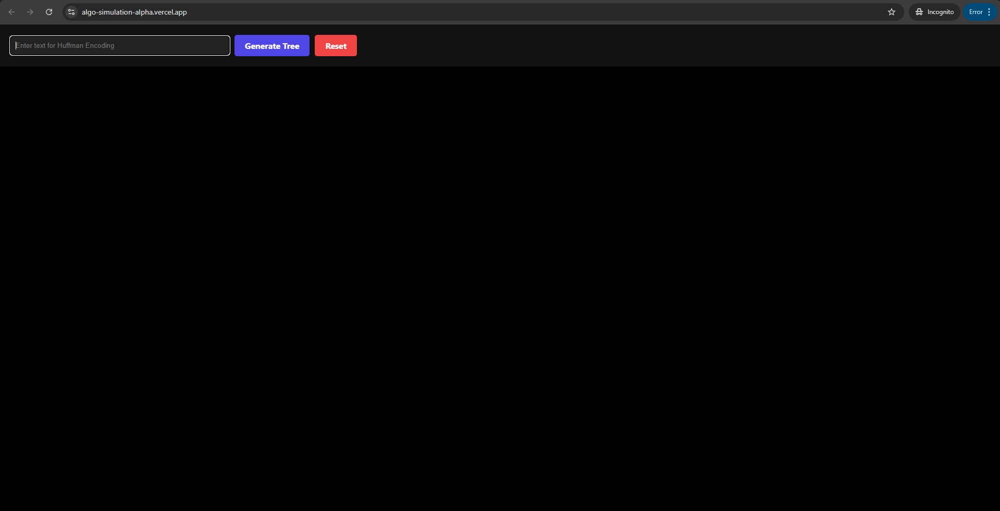
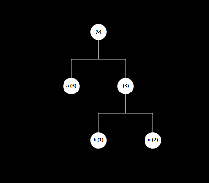
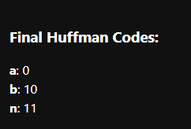
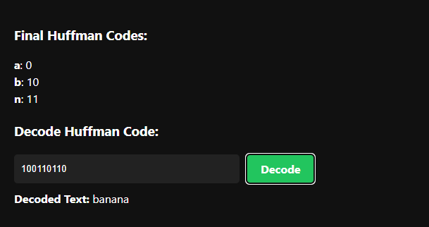

# Huffman Encoding Visualizer

A React + Vite-based interactive visualization tool that demonstrates **Huffman Encoding** step-by-step.  
It builds the Huffman Tree, generates binary codes for each character, and allows encoding/decoding of text in real time.

## 🚀 Features
- **Step-by-Step Tree Building** – Merges the two smallest frequency nodes in sequence with narration.
- **Animated Visualization** – Uses `react-d3-tree` for rendering Huffman trees dynamically.
- **Huffman Code Generation** – Automatically generates binary codes for each character.
- **Decode Functionality** – Allows decoding of any Huffman-encoded binary string using the generated tree.
- **Auto Animation** – Tree updates every 1.5 seconds to the next step.
- **Reset Button** – Quickly clear the visualization and start over.

## 🛠️ Tech Stack
- **React + Vite** – UI & state management.
- **react-d3-tree** – Tree visualization.
- **JavaScript (ES6)** – Core logic for Huffman encoding/decoding.
- **CSS** – Styling.

## 📂 How It Works
1. **Input Text** → Enter any text you want to encode.
2. **Generate Tree** → The app calculates character frequencies and begins merging nodes.
3. **Visualization** → Watch the Huffman Tree build itself step-by-step.
4. **Final Codes** → See each character's binary Huffman code.
5. **Decode** → Enter a binary string to decode it back to the original text.

## ▶️ Usage
```bash
# Clone the repo
git clone https://github.com/yourusername/huffman-visualizer.git

# Navigate into the folder
cd huffman-visualizer

# Install dependencies
npm install

# Start the development server (Vite)
npm run dev
```

## 📷 Screenshots

### 1️⃣ Home Page / Input Screen
Home Page


### 2️⃣ Tree Building Animation


https://github.com/user-attachments/assets/79f183bd-6f3f-451e-a1c2-d6246e6a1d0c


### 3️⃣ Generated Tree


### 4️⃣ Generated Huffman Codes


### 5️⃣ Decoding Example

